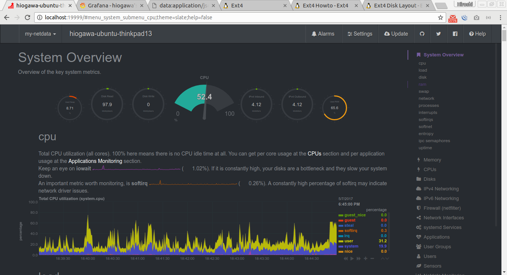
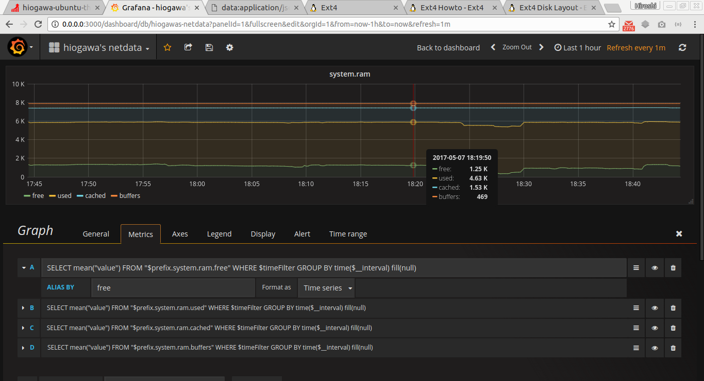

<!--
{
  "title": "Sytem Monitoring Architecture",
  "date": "2017-05-02T11:37:01+09:00",
  "category": "",
  "tags": ["linux", "monitoring"],
  "draft": true
}
-->

# TODO

- types of monitoring ?
  - performance (is this what netdata is categorized into ?)
- system statistics
  - cpu, memory, storage usage, process, network
  - what's the preferred bound for each stats ?
- persistence
  - time-series database
  - example: https://github.com/firehol/netdata/wiki/Using-Netdata-with-Prometheus
  - https://github.com/prometheus/prometheus
- log
- alarm
- application specific statistics
  - web server, load balancer
    - number of request
    - request succession
    - latency
    - examples:
      - https://nginx.org/en/docs/http/ngx_http_stub_status_module.html
      - https://docs.traefik.io/toml/#api-backend
  - database
    - connection
    - transaction
    - lock
    - examples:
      - https://mariadb.com/kb/en/mariadb/show-status/
  - cache
    - examples:
      - https://redis.io/commands/info
  - ruby application
    - rack server layer (e.g. puma)
    - rack app layer (e.g. rails)
  - elasticsearch
    - https://github.com/elastic/elasticsearch/blob/master/docs/reference/cluster/nodes-stats.asciidoc


# Netdata

- https://github.com/firehol/netdata/wiki/Article%3A-Introducing-netdata
- https://github.com/firehol/netdata/wiki/mynetdata-menu-item
- Important statistics
- statistics collection
  - simply reading /proc
- alarm
  - how to implement ?
- in-memory things
- data visualization on browser
- web server
- plugin architecture
- threading and forking (IPC ?)


# Setup for my machine

Stack

- Netdata (as realtime statistics collecter and as frontend by itself)
- Influxdb (as time-series data persistence)
- Grafana (as frontend for influxdb)


Build from source

```
# Netdata: https://github.com/firehol/netdata/wiki/Installation
$ git clone https://github.com/firehol/netdata.git --depth=1
$ cd netdata
$ mkdir -p _install
$ ./netdata-installer.sh --install $PWD/_install


# Go: https://go.googlesource.com/go/+/master/doc/install-source.html
$ ... build and setup GOPATH ...
$ go version
go version devel +164f99e Mon May 1 00:56:40 2017 +0000 linux/amd64


# Influxdb: https://github.com/influxdata/influxdb/blob/master/CONTRIBUTING.md
$ git clone git@github.com:influxdata/influxdb.git
$ mkdir -p $GOPATH/src/github.com/influxdata
$ ln -sf $PWD/influxdb $GOPATH/src/github.com/influxdata/influxdb
$ cd $GOPATH/src/github.com/influxdata/influxdb
$ go get github.com/sparrc/gdm
$ gdm restore
$ go clean ./...
$ go install ./...

# Grafana: https://github.com/grafana/grafana/blob/master/README.md
$ git clone git@github.com:grafana/grafana.git
$ mkdir -p $GOPATH/src/github.com/grafana
$ ln -sf $PWD/grafana $GOPATH/src/github.com/grafana/grafana
$ cd $GOPATH/src/github.com/grafana/grafana
$ go run build.go setup
$ go run build.go build
$ npm install -g yarn   # I didn't build nodejs/npm from source ...
$ yarn install --pure-lockfile
```  


Configuration

```
$ ./_install/netdata/usr/sbin/netdata
# netdata.conf
[backend]
	enabled = yes
	data source = average
	type = graphite
	destination = localhost:2003
	prefix = netdata
	hostname = hiogawa-ubuntu-thinkpad13
	update every = 10
	buffer on failures = 10
	timeout ms = 20000

$ influxd run -config $PWD/influxdb.conf
# influxdb.conf
[[graphite]]
  enabled = true
  bind-address = ":2003"
  database = "graphite"
  retention-policy = ""
  protocol = "tcp"
  batch-size = 5000
  batch-pending = 10
  batch-timeout = "1s"
  consistency-level = "one"
  separator = "."
  udp-read-buffer = 0


$ ./bin/grafana-server
# from dashboard editor in browser, put something like
# SELECT mean("value") FROM "$prefix.system.ram.free" WHERE $timeFilter GROUP BY time($__interval) fill(null)
```


Screenhosts





References

- netdata to influxdb
  - https://github.com/firehol/netdata/wiki/netdata-backends
  - https://github.com/influxdata/influxdb/blob/master/services/graphite/README.md
- influxdb to grafana
  - https://github.com/grafana/grafana/blob/master/docs/sources/features/datasources/influxdb.md
